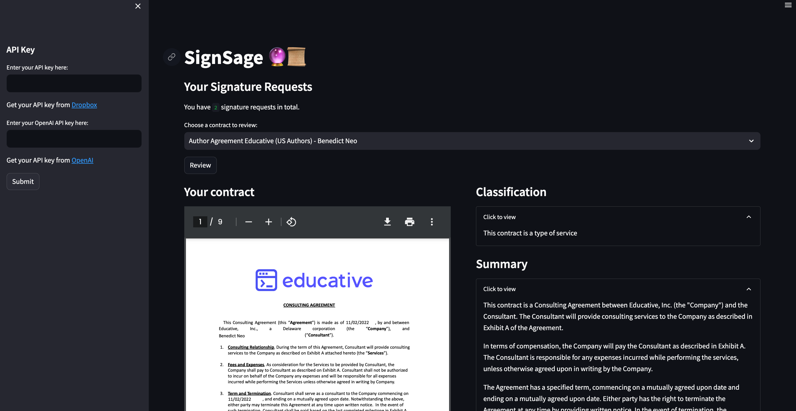

# SignSage

Built for the [Dropbox Sign AI-Powered Agreements Hackathon](https://dropboxhackathon2023.devpost.com/)

## Overview

**SignSage** is a Streamlit application designed to assist users in reviewing, classifying, and understanding contracts using the power of GPT-3 by OpenAI. With deep integration of the Dropbox Sign API, users can fetch their signature requests from Dropbox and gain insights about the contracts they're about to sign.

## Features

1. **Document Review & Classification:** Identify the type of contract and receive a concise summary.
2. **Party Details Extraction:** Extract names and other details of the parties involved in the contract.
3. **Important Dates Extraction:** Highlight important dates and associated obligations.
4. **Obligations Highlight:** Enumerate key obligations stipulated in the contract.
5. **Termination Clauses Extraction:** Highlight clauses related to the termination of the contract.
6. **Confidentiality & Non-compete Clauses Highlight:** Identify clauses related to confidentiality and non-compete agreements.
7. **Dropbox Integration:** Fetch signature requests directly from your Dropbox account.
8. **PDF Display:** In-app display of contracts in PDF format.

## Tech Stack

1. **Frontend**: Streamlit
2. **Document Analysis**: GPT-3.5 by OpenAI and instructor for structured outputs
3. **Document Parsing**: PyPDF2
4. **Document Signature**: Dropbox Sign API

---

## Getting Started

### API Keys:

Before you can use the application, you will need API keys from both Dropbox and OpenAI:

- Dropbox API Key: [Get your API key from Dropbox](https://www.dropbox.com/developers/apps)
- OpenAI API Key: [Get your API key from OpenAI](https://platform.openai.com/account/api-keys)

Enter these API keys into the sidebar of the application to get started.

### How it works?

1. Upon successful input of the API keys, your signature requests from Dropbox will be listed.
2. Select the contract you wish to review.
3. Click on the "Review" button.
4. The application will then fetch, display, and analyze the contract, presenting various insights in a side-by-side format.

Here's how it looks

## References

- [API docs](https://developers.hellosign.com/)
- [Python SDK GitHub](https://github.com/hellosign/dropbox-sign-python)
- [Dropbox AI principles](https://www.dropbox.com/ai-principles)
- [Instructor Data Extraction](https://jxnl.github.io/instructor/examples/pii/)
